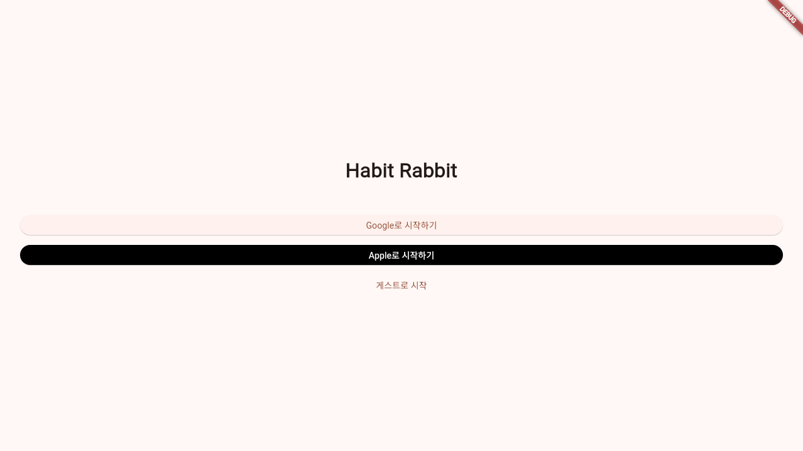

# Habit Rabbit

토끼굴 세계관과 당근 포인트 경제를 결합한 습관 트래커 앱입니다. Flutter + Riverpod 기반으로 구성되어 있으며, 로컬 저장(Hive)과 Firebase(인증/Firestore/Remote Config) 동기화를 결합한 구조입니다.

## Screenshot



## 주요 기능

- **로그인**: Google / Apple / 게스트 로그인
- **온보딩**: 설문 기반 습관 추천 및 첫 습관 생성 플로우
- **습관 관리**: 추가/수정/삭제, 오늘의 습관 목록 및 체크인
- **스트릭/달성률**: 연속 달성 스트릭 및 월간 달성률
- **당근 포인트 경제**: 습관 완료 시 포인트 적립
- **샵/꾸미기**: 아이템 구매 및 장착(토끼/굴 꾸미기)
- **미션**: 미션 달성 보상
- **통계**: 기본 통계/프리미엄 통계 화면
- **알림 설정**: 습관 알림 관리
- **프리미엄 게이트**: 구독 유도 UI/블러 프리뷰

## 기술 스택

- **Flutter / Dart**
- **상태관리**: Riverpod
- **로컬 저장소**: Hive
- **원격 백엔드**: Firebase Auth, Firestore, Remote Config
- **구독/결제**: RevenueCat

## 아키텍처 개요

```
lib/
  data/         # 데이터 소스 및 리포지토리 구현 (Hive/Firebase/RevenueCat)
  domain/       # 엔티티, 유스케이스, 리포지토리 인터페이스
  presentation/ # Riverpod Provider, UI(Screen/Widget)
```

- **Presentation → Domain → Data** 흐름의 레이어드 구조
- **SyncHabitRepository**를 통해 로컬(Hive) ↔ 원격(Firestore) 동기화
- 인증/구독/알림 등은 Provider로 주입 및 상태 관리

## 실행 방법

### 1) 필수 요건

- Flutter SDK (Dart SDK 포함)
- iOS/Android 빌드 환경 (선택)

### 2) 의존성 설치

```bash
flutter pub get
```

### 3) Firebase 설정

이 프로젝트는 Firebase를 사용합니다. 아래 중 하나로 설정을 완료하세요.

- **FlutterFire CLI 사용**
  ```bash
  flutterfire configure
  ```
  실행 후 `lib/firebase_options.dart` 생성

- **플랫폼별 설정 파일 추가**
  - Android: `android/app/google-services.json`
  - iOS: `ios/Runner/GoogleService-Info.plist`

### 4) RevenueCat API Key 설정

`lib/main.dart`의 `PurchasesConfiguration('YOUR_REVENUECAT_API_KEY')` 값을 실제 키로 교체합니다.

### 5) 실행

```bash
flutter run -d <device>
```

웹 실행 시:

```bash
flutter run -d web-server --web-port 8080
```

## 테스트

```bash
flutter test
```

## 문서

- `docs/` : PRD, 리서치, MVP 플랜 등 기획 문서

## 라이선스

Private (publish_to: none)
